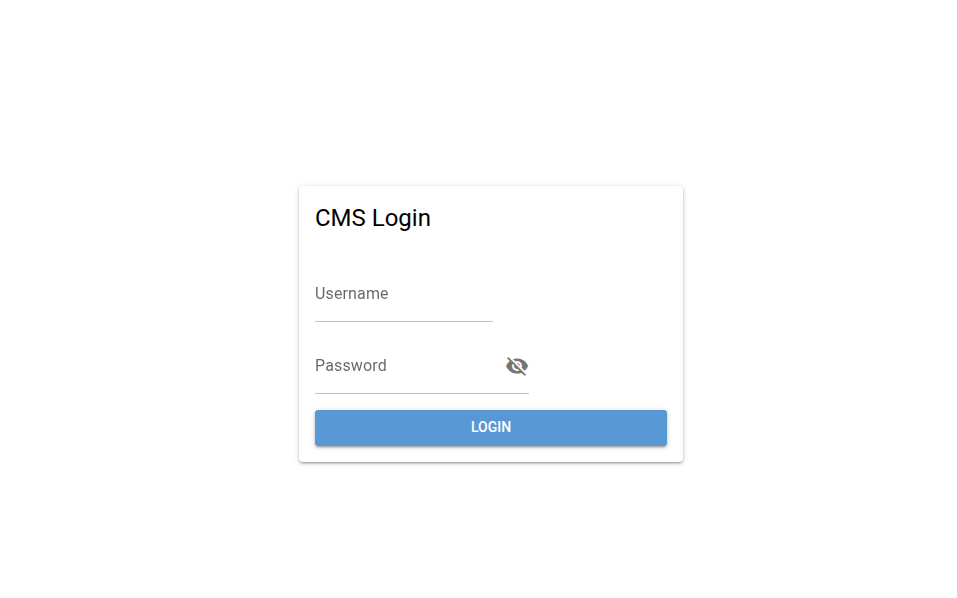
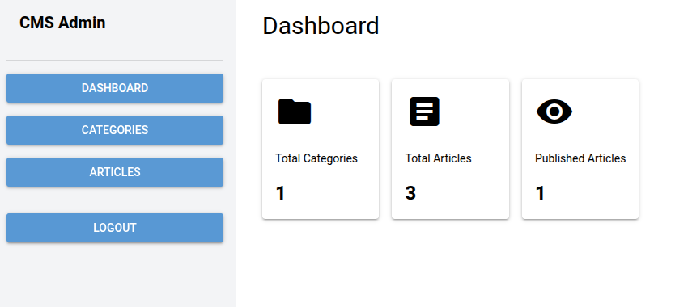
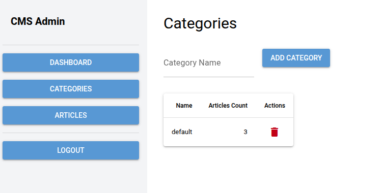
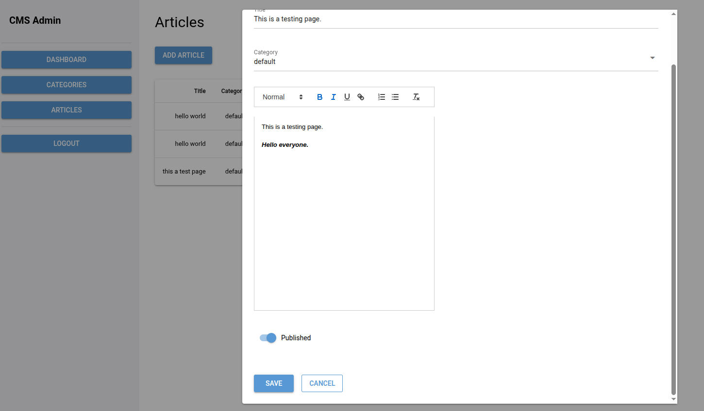

nicegui-playground
------------------

>   NiceGUI demo: A Simple CMS (Content Management System) built with SQLite database support.

### CMS Features

- **User Authentication**: Secure login system with session management
- **Dashboard**: Overview with key metrics and statistics
- **Article Management**: Full CRUD operations for articles
- **Category Management**: Create, edit, and delete categories
- **Database**: SQLite database with Tortoise ORM

### Quick Start

```bash
cd playground/simple-cms
# Run the CMS main.py
uv run main.py

# Open browser to http://localhost:8080
# Login with demo credentials: admin/123456
```

### CMS Database Schema

The CMS includes three main models:

- **User**: Authentication and user management
- **Category**: Article categorization
- **Article**: Content management with full CRUD operations

### Snapshots







